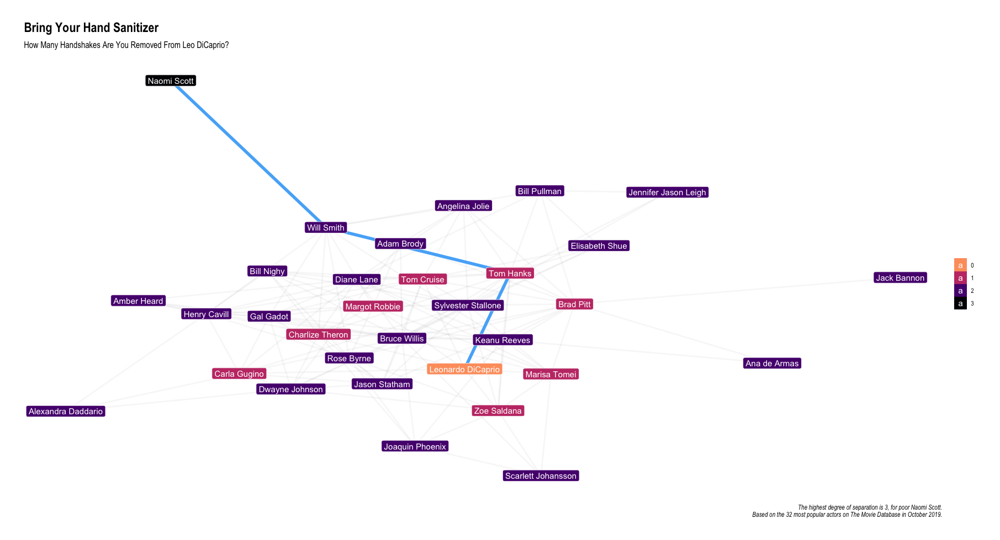

```{r setup, include=FALSE}
# knitr::opts_chunk(warning = FALSE, message = FALSE, fig.retina = 3)
options(htmltools.dir.version = FALSE)
```

---
<!-- class: inverse, center, middle -->

# Overview

---

# Overview

.pull-left[

- Network Components
- Data Structures
- Network Viz
- Network Analysis
- Interactivity

]

.pull-right[



]

---

# Test

.pull-left[
...

]
.pull-right[
...

]

---

# Degrees of Separation


Show actor app to explain the network
Turn this slide into a title slide

---
class: inverse, center, middle

# Network Components

---

# Nodes & Edges

Image of network

- cover edges
- cover nodes

---

# Layout

Cover layouts

---

# Direction

Cover directions

---

# Types

Show tree

---
class: inverse, center, middle

# Data Representation

---

# Adjacency matrix

Show adj matrix

---

# Edge list

Show edge list

---

# Tidygraph

Show how actor data is represented in tidygraph

---

# Tidygraph

Include exercise with tidygraph in LearnR

- demonstrate `activate()`
- filter out nodes w/o edges
- filter out edges w/o nodes

---
class: inverse, center, middle

# Network Visualisation

---

# ggraph

Package to do ggplot2 style syntax for network visualisation

Interfaces with other network packages like `{igraph}`

# Layout nodes

Include learnR template to try different node layouts,
for the actor network without degrees of separation specified

# Layout edges

Include learnR template to try different edge layouts

---
class: inverse, center, middle

# Network Analysis

---

# Purpose

We want to learn something about the network:

In our case, based on the concept of 6 degrees of separation"

- How far are actors removed from each other
- What is the shortest path between two actors.


E.g. how many handshakes are you removed from Leo DiCaprio

# Degrees of Separation

Code to demonstrate how to calculate degrees of separation

# Shortest Path

Code to demonstrate how to calculate shortest path

---
class: inverse, center, middle

# Network Exploration

---

# Network analysis through interactivity

Build a shiny app

Let user decide who is the central node and to whom to calculate the shortest path.

# Shiny

Highlight code that makes the visualisation interactive.
