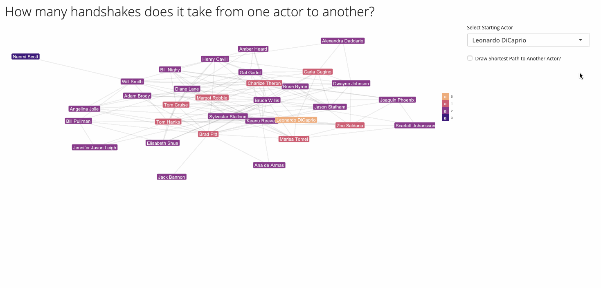

class: inverse, center, middle

```{r setup, include=FALSE}
knitr::opts_chunk$set(echo = TRUE, 
                      warning = FALSE, 
                      message = FALSE, 
                      fig.retina = 3, 
                      cache = TRUE)
options(htmltools.dir.version = FALSE)

library(ggraph)
library(igraph)
library(stringr)
library(tidygraph)
library(tidyr)
library(purrr)
library(readxl)
```

# Overview

---

# Overview

.pull-left[

- Network Components
- Data Structures
- Network Viz
- Network Analysis
- Interactivity

]

.pull-right[

<em> Here a nice network image </em>

]

---
class: inverse, center, middle

# Case Study

---

# Six Degrees of Separation

<br/>
.center["<em>Everyone knows everyone else in six handshakes</em>"]
<br/>


```{r echo=FALSE, out.width = 800}

```


---
class: inverse, center, middle

# Network Components

---

# Nodes & Edges

.center[
```{r echo=FALSE, fig.width = 12}
load("resources/actor_data_course3.rdata")

actor_network %>%
  ggraph(layout = "kk") +
  geom_edge_fan(colour = "#AAAAAA") +
  geom_node_point(size = 4, colour = "#6699CC") +
  theme_graph() +
  theme(legend.position = "none")
```
]

---

# Layout

.center[
```{r echo=FALSE, fig.width = 12}
actor_network %>%
  ggraph(layout = "kk") +
  geom_edge_fan(colour = "#AAAAAA") +
  geom_node_point(size = 4, colour = "#6699CC") +
  theme_graph() +
  theme(legend.position = "none")
```
]

---

# Layout

.center[
```{r echo=FALSE, fig.width = 12}
actor_network %>%
  ggraph(layout = "fr") +
  geom_edge_fan(colour = "#AAAAAA") +
  geom_node_point(size = 4, colour = "#6699CC") +
  theme_graph() +
  theme(legend.position = "none")
```
]

---

# Layout

.center[
```{r echo=FALSE, fig.width = 12}
actor_network %>%
  ggraph() +
  geom_edge_fan(colour = "#AAAAAA") +
  geom_node_point(size = 4, colour = "#6699CC") +
  theme_graph() +
  theme(legend.position = "none")
```
]

---

# Layout

.center[
```{r echo=FALSE, fig.width = 12}
actor_network %>%
  ggraph(layout = "circle") +
  geom_edge_fan(colour = "#AAAAAA") +
  geom_node_point(size = 4, colour = "#6699CC") +
  theme_graph() +
  theme(legend.position = "none")
```
]

---

# Layout

.center[

<em> Some layouts are specific to certain types of networks </em>

```{r echo=FALSE, fig.width = 12}
nodes_tibble <-
  read_xlsx(file.path("resources", "tree_basic_labels.xlsx"), sheet = "nodes")
edges_tibble <-
  read_xlsx(file.path("resources", "tree_basic_labels.xlsx"), sheet = "edges")

tidy_tree <- tbl_graph(
  nodes = nodes_tibble,
  edges = edges_tibble
)

ggraph(tidy_tree, layout = "circle") +
  geom_edge_fan(colour = "#AAAAAA") +
  geom_node_point(size = 4, colour = "#6699CC") +
  theme_graph() +
  ylim(-1.6, NA)
```
]

---

# Layout

.center[

<em> Here, a "tree" would be more appropriate </em>

```{r echo=FALSE, fig.width = 12}
ggraph(tidy_tree, layout = "dendrogram") +
  geom_edge_fan(colour = "#AAAAAA") +
  geom_node_point(size = 4, colour = "#6699CC") +
  theme_graph() +
  ylim(-1.6, NA)
```

]

---
# Layout

.center[

<em> A tree of trees </em>

```{r echo=FALSE, fig.width = 12}
ggraph(tidy_tree, layout = "dendrogram", circular = FALSE) +
  geom_edge_diagonal(colour = "tan4", width = 2) +
  geom_node_point(size = 7, colour = "tan4", alpha = 0.5) +
  geom_node_text(aes(label = label),
    colour = "darkolivegreen4",
    size = 4,
    angle = 90,
    hjust = 1,
    nudge_y = -0.4
  ) +
  theme_graph() +
  ylim(-1.6, NA)
```

]

---

# Direction

.center[
```{r echo=FALSE, fig.width = 12}
set.seed(8)
actor_network %>%
  as.directed() %>% 
  as_tbl_graph() %>% 
  activate(nodes) %>% 
  slice(1:15) %>% 
  activate(edges) %>%
  slice(c(1:16, sample(17:32, 5))) %>%
  ggraph(layout = "kk") +
  geom_edge_fan(colour = "#AAAAAA",
                arrow = arrow(length = unit(2, "mm")),
                start_cap = circle(5, "mm"),
                end_cap = circle(5, "mm")) +
  geom_node_point(size = 4, colour = "#6699CC") +
  theme_graph() +
  theme(legend.position = "none")
```
]

---

# Direction

.center[
```{r echo=FALSE, fig.width=12}
  ggraph(tidy_tree, layout = "dendrogram") +
  geom_edge_diagonal(
    arrow = arrow(length = unit(4, "mm")),
    start_cap = circle(5, "mm"),
    end_cap = circle(5, "mm"),
    colour = "tan4"
  ) +
  geom_node_point(size = 4, alpha = 0.8, colour = "darkolivegreen4") +
  geom_node_label(aes(label = label), vjust = 0.7) +
  ylim(-1.6, NA) +
  theme_graph()
```
]

---

# Types

- Directional / non-directional
- Hierarchical / non-hierarchical


- Trees / Dendrograms
- Social networks
- Transport networks
- Flowcharts

---
class: inverse, center, middle

# Data Representation

---

# Adjacency matrix

.center[

```{r echo=FALSE}
n_nodes <- 
  actor_network %>% 
  activate(nodes) %>% 
  as_tibble() %>% 
  nrow()

adj_mat <- 
  matrix(0, n_nodes, n_nodes)

crds <- cbind(  actor_network %>%
                  activate(edges) %>% 
                  as_tibble() %>% 
                  pull(from),
                actor_network %>%
                  activate(edges) %>% 
                  as_tibble() %>% 
                  pull(to))

for (ii in 1:nrow(crds)) {
  adj_mat[crds[ii,1], crds[ii,2]] <- 1
  adj_mat[crds[ii,2], crds[ii,1]] <- 1
}

colnames(adj_mat) <- 
  actor_network %>% 
  activate(nodes) %>% 
  as_tibble() %>% 
  pull(name)

rownames(adj_mat) <- colnames(adj_mat)
  
adj_mat[14:18, 14:18] %>% 
  as_tibble(rownames = "actor") %>% 
  DT::datatable(options = list("paging" = FALSE,
                               "searching" = FALSE,
                               "ordering" = FALSE,
                               "info" = FALSE),
                rownames = FALSE)
```

]

---

# Edge List

```{r echo=FALSE}
edge_list <- 
  actor_network %>% 
  activate(edges) %>% 
  as_tibble()

from <- edge_list$from
to <- edge_list$to

node_names <- 
  actor_network %>% 
  activate(nodes) %>% 
  as_tibble() %>% 
  pull(name)

for (ii in 1:nrow(edge_list)) {
  edge_list[ii, 1] <- node_names[from[ii]]
  edge_list[ii, 2] <- node_names[to[ii]]
}

edge_list %>% 
  arrange() %>% 
  slice(42:50) %>% 
  DT::datatable(options = list("paging" = FALSE,
                               "searching" = FALSE,
                               "ordering" = FALSE,
                               "info" = FALSE),
                rownames = FALSE)
```

---
class: inverse, center, middle

# Enter Tidygraph

---

# Tidygraph

```{r echo=FALSE, highlight.output=c(5, 16)}
actor_network
```

---

# Tidygraph

.pull-left[

```{r echo=FALSE}
actor_network %>% 
  activate(nodes) %>% 
  as_tibble() %>%
  slice(1:8) %>% 
  DT::datatable(options = list("paging" = FALSE,
                               "searching" = FALSE,
                               "ordering" = FALSE,
                               "info" = FALSE),
                caption = "Nodes Tibble")
```

]

.pull-right[

```{r echo=FALSE}
actor_network %>% 
  activate(edges) %>% 
  as_tibble() %>% 
  slice(1:8) %>% 
  DT::datatable(options = list("paging" = FALSE,
                               "searching" = FALSE,
                               "ordering" = FALSE,
                               "info" = FALSE),
                rownames = FALSE,
                caption = "Edges Tibble")

```

]

---

# Tidygraph

```{r eval=FALSE}
actor_network %>% 
  activate(nodes) #<<
```

<hr>

```{r echo=FALSE, highlight.output=c(5:14)}
actor_network %>% 
  activate(nodes)
```

---

# Tidygraph

```{r eval=FALSE}
actor_network %>% 
  activate(edges) #<<
```

<hr>

```{r echo=FALSE, highlight.output=c(5:14)}
actor_network %>% 
  activate(edges)
```

---

# Tidygraph

<em> Most `{dplyr}` verbs work with `{tidygraph}` </em>

---

# Tidygraph

<em> Most `{dplyr}` verbs work with `{tidygraph}` </em>

<hr>
```{r eval=FALSE}
actor_network %>% 
  activate(nodes) %>% 
  filter(name != "Keanu Reeves") #<<
```

--
<hr>

```{r echo=FALSE, highlight.output=c(1)}
actor_network %>% 
  activate(nodes) %>% 
  filter(name != "Keanu Reeves") #<<
```

---

# Tidygraph

<em> Most `{dplyr}` verbs work with `{tidygraph}` </em>


---

# Tidygraph

<em> Most `{dplyr}` verbs work with `{tidygraph}` </em>

<hr>
```{r eval=FALSE}
actor_network %>% 
  activate(nodes) %>% 
  mutate(appreciation = rep(c(emo::ji("sunglasses"), emo::ji("tomato")), n()/2)) #<<
```

--
<hr>

```{r echo=FALSE}
actor_network %>% 
  activate(nodes) %>% 
  mutate(appreciation = rep(c(emo::ji("sunglasses"), emo::ji("tomato")), n()/2))
```


---


class: inverse, center, middle

# Network Visualisation

---

# ggraph

A`{ggplot2}` style way to plotting network data

---

# ggraph

.pull-left[
```{r plot-last, fig.show = 'hide'}
ggraph(actor_network) +
  geom_node_point(size = 4, 
                  colour = "#6699CC") +
  theme_graph()
```
]
.pull-right[
```{r ref.label = 'plot-last', echo = FALSE, fig.width = 6}
```
]

---

# ggraph

.pull-left[
```{r plot-last2, fig.show = 'hide'}
ggraph(actor_network) +
  geom_edge_fan(colour = "#AAAAAA") + #<<
  geom_node_point(size = 4, 
                  colour = "#6699CC") +
  theme_graph()
```
]
.pull-right[
```{r ref.label = 'plot-last2', echo = FALSE, fig.width = 6}
```
]

---

# ggraph

.pull-left[
```{r plot-last3, fig.show = 'hide'}
ggraph(actor_network, layout = "kk") + #<<
  geom_edge_fan(colour = "#AAAAAA") + 
  geom_node_point(size = 4, 
                  colour = "#6699CC") +
  theme_graph()
```
]
.pull-right[
```{r ref.label = 'plot-last3', echo = FALSE, fig.width = 6}
```
]

---

# ggraph

.pull-left[
```{r plot-last4, fig.show = 'hide'}
ggraph(actor_network, layout = "kk") + 
  geom_edge_fan(colour = "#AAAAAA") + 
  geom_node_label( #<<
    aes(label = name), #<<
    fill = "#6699CC" #<<
  ) + #<<
  theme_graph()
```
]
.pull-right[
```{r ref.label = 'plot-last4', echo = FALSE, fig.width = 6}
```
]


---

# Layout nodes

Include learnR template to try different node layouts,
for the actor network without degrees of separation specified

---
class: inverse, center, middle

# Network Analysis

---

# Purpose

We want to learn something about the network.

In our case:

- How far are actors removed from each other?
- What is the shortest path between two actors?

---
class: inverse, center, middle

# Degrees of Separation

---

# Degrees of Separation

Calculate distances with `{igraph}`

--
<hr>

```{r results='hide'}
actor_distances <- 
  igraph::distances(actor_network)
```

--
<hr>

```{r echo=FALSE}
actor_distances[14:18, 14:18] %>% 
  as_tibble(rownames = "actor") %>% 
  DT::datatable(options = list("paging" = FALSE,
                               "searching" = FALSE,
                               "ordering" = FALSE,
                               "info" = FALSE),
                rownames = FALSE)
```

---
# Degrees of Separation

Say we want to know for each actor the distance to <em>Leonardo DiCaprio</em>.

--
<hr>

```{r results = "hide"}
central_actor <- "Leonardo DiCaprio"
how_far_is_leo <- actor_distances[central_actor, ]
```

--
<hr>

```{r}
how_far_is_leo
```

---
# Degrees of Separation

Let's add this to our `tbl_graph` data.

--
<hr>

```{r results = "hide"}
actor_network <-
  actor_network %>%
  activate(nodes) %>%
  mutate(steps_from_central_node = as.character(how_far_is_leo)) #<<
```

--
<hr>

```{r highlight.output=c(6)}
actor_network
```

---
class: inverse, center, middle

# Plot it, plot it, plot it

---

# Degrees of Separation

.pull-left[
```{r plot-last5, fig.show = 'hide'}
ggraph(actor_network, layout = "kk") + 
  geom_edge_fan(colour = "#AAAAAA") + 
  geom_node_label(
    aes(label = name,
        fill = steps_from_central_node), #<<
    colour = "white", #<<
  ) + 
  scale_fill_viridis_d( #<<
    option = "A", #<<
    end = 0.8, #<<
    direction = -1 #<<
  ) + #<<
  theme_graph()
```
]

.pull-right[
```{r ref.label = 'plot-last5', echo = FALSE, fig.width = 6}
```
]

---
# Degrees of Separation

```{r echo=FALSE, fig.width = 12}
ggraph(actor_network, layout = "kk") + 
  geom_edge_fan(colour = "#AAAAAA") + 
  geom_node_label(
    aes(label = name,
        fill = steps_from_central_node), #<<
    colour = "white", #<<
  ) + 
  scale_fill_viridis_d( #<<
    option = "A", #<<
    end = 0.8, #<<
    direction = -1 #<<
  ) + #<<
  theme_graph()
```

---
class: inverse, center, middle

# Shortest Path

---

# Shortest Path

Naomi Scott is *really* far removed from Leo.
What would be the quickest way for them to get to know each other?

---

# Shortest Path


class: inverse, center, middle

# Network Exploration

---

# Network analysis through interactivity

Build a shiny app

Let user decide who is the central node and to whom to calculate the shortest path.

# Shiny

Highlight code that makes the visualisation interactive.
